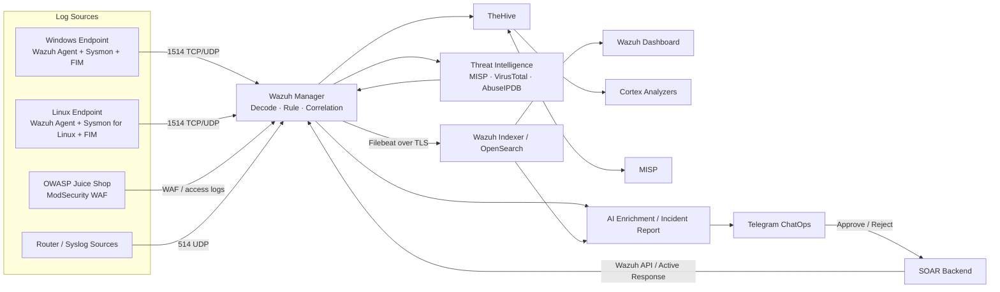

# WAZUH SIEM/SOAR — Nền tảng SOC tích hợp AI và Threat Intelligence

> Hệ thống giám sát, điều tra và phản ứng sự cố an toàn thông tin được xây dựng trên Wazuh Distributed Architecture, tích hợp OpenSearch, TheHive, Cortex, MISP, Telegram ChatOps, Threat Intelligence và các chức năng AI hỗ trợ SOC.

[](#)
[](https://wazuh.com/)
[](https://opensearch.org/)
[](https://thehive-project.org/)
[](https://www.misp-project.org/)
[](https://www.python.org/)
[](#trạng-thái-bàn-giao)


---

## Mục lục

- [1. Tổng quan](#1-tổng-quan)
- [2. Mục tiêu và phạm vi](#2-mục-tiêu-và-phạm-vi)
- [3. Trạng thái bàn giao](#3-trạng-thái-bàn-giao)
- [4. Kiến trúc hệ thống](#4-kiến-trúc-hệ-thống)
- [5. Quy hoạch hạ tầng](#5-quy-hoạch-hạ-tầng)
- [6. Luồng dữ liệu và xử lý sự cố](#6-luồng-dữ-liệu-và-xử-lý-sự-cố)
- [7. Nền tảng và công nghệ](#7-nền-tảng-và-công-nghệ)
- [8. Detection Engineering và MITRE ATT&CK](#8-detection-engineering-và-mitre-attck)
- [9. Threat Intelligence, TheHive và Cortex](#9-threat-intelligence-thehive-và-cortex)
- [10. AI, ChatOps và NL2Query](#10-ai-chatops-và-nl2query)
- [11. Dashboard, SOC Workflow và Playbook](#11-dashboard-soc-workflow-và-playbook)
- [12. Kết quả kiểm thử](#12-kết-quả-kiểm-thử)
- [13. Cấu trúc repository](#13-cấu-trúc-repository)
- [14. Hướng dẫn triển khai](#14-hướng-dẫn-triển-khai)
- [15. Kiểm tra vận hành](#15-kiểm-tra-vận-hành)
- [16. Bảo mật và quản lý secrets](#16-bảo-mật-và-quản-lý-secrets)
- [17. Known Issues và lộ trình](#17-known-issues-và-lộ-trình)
- [18. Thành viên](#18-thành-viên)
- [19. Tài liệu tham khảo](#19-tài-liệu-tham-khảo)

---

## 1. Tổng quan

Dự án xây dựng một nền tảng SOC thu gọn theo mô hình phân tán, lấy **Wazuh** làm lõi SIEM và **OpenSearch** làm tầng lưu trữ, tìm kiếm và phân tích dữ liệu. Hệ thống tiếp nhận telemetry từ endpoint Windows/Linux, FIM, Sysmon, Sysmon for Linux, Syslog và ứng dụng web OWASP Juice Shop đặt sau ModSecurity WAF.

Các cảnh báo sau khi được giải mã và đối sánh rule có thể được:

- làm giàu bằng VirusTotal, AbuseIPDB và MISP;
- ánh xạ theo MITRE ATT&CK;
- gửi sang TheHive để quản lý case và Cortex để phân tích observable;
- tóm tắt bằng AI theo schema có cấu trúc;
- gửi đến Telegram để triage và phê duyệt phản ứng;
- xử lý bằng Wazuh Active Response theo mô hình human-in-the-loop.

Dự án ưu tiên khả năng trình diễn end-to-end, tính minh bạch trong vận hành và khả năng tiếp tục phát triển. Hệ thống **chưa được xem là production-ready** nếu chưa hoàn thành các hạng mục bảo mật, high availability, quản lý secrets, regression test và giảm false positive nêu trong tài liệu này.

### Giá trị chính

| Bài toán | Cách tiếp cận |
|---|---|
| Dữ liệu an ninh phân tán | Chuẩn hóa log Windows, Linux, FIM, Sysmon, Syslog và WAF về Wazuh Manager. |
| Cảnh báo thiếu ngữ cảnh | Kết hợp process, network, file, IOC và Threat Intelligence. |
| Triage thủ công | MITRE mapping, AI narrative và Incident Report có cấu trúc. |
| Phản ứng chậm | Telegram escalation, nút Approve/Reject và Active Response. |
| Thiếu quản lý vòng đời sự cố | TheHive case management kết hợp Cortex analyzer. |
| Threat hunting khó tiếp cận | Dashboard/Discover và nguyên mẫu NL2Query qua Telegram. |

---

## 2. Mục tiêu và phạm vi

### 2.1. Mục tiêu

- Xây dựng kiến trúc Wazuh Distributed tách Manager, Indexer và Dashboard.
- Thu thập telemetry có chiều sâu từ Windows và Linux.
- Thiết kế custom decoder, rule và correlation rule cho các tình huống tấn công phổ biến.
- Chuẩn hóa cảnh báo theo MITRE ATT&CK Enterprise.
- Tích hợp MISP, VirusTotal và AbuseIPDB để làm giàu IOC.
- Tích hợp TheHive/Cortex cho case management và observable analysis.
- Xây dựng Telegram ChatOps và Active Response có bước phê duyệt.
- Ứng dụng AI cho alert enrichment, Incident Report và truy vấn OpenSearch bằng ngôn ngữ tự nhiên.
- Kiểm thử hệ thống bằng các kịch bản Red/Purple Team trong lab.

### 2.2. Trong phạm vi

- Wazuh Manager, Indexer và Dashboard phân tán.
- Windows Agent + Sysmon + FIM.
- Linux Agent + Sysmon for Linux + FIM và audit telemetry.
- OWASP Juice Shop chạy Docker, kết hợp ModSecurity OWASP CRS 3.3.
- TheHive, Cortex, MISP, VirusTotal, AbuseIPDB và Telegram Bot.
- Custom decoder/rule, IOC correlation và MITRE ATT&CK mapping.
- AI Incident Report và nguyên mẫu NL2Query.
- Red/Purple Team trong mạng lab nội bộ.

### 2.3. Ngoài phạm vi hoặc chưa nghiệm thu

- High availability nhiều Indexer node và replica.
- Pentest trên hệ thống production hoặc tài sản không được ủy quyền.
- EDR thương mại, macOS, IoT và OT/ICS.
- Dynamic Playbook hoàn chỉnh.
- AI Gap Analysis hoàn chỉnh.
- Phản ứng tự động hoàn toàn không có human-in-the-loop.
- Cam kết SLA production, DR site hoặc multi-tenant SOC.

---

## 3. Trạng thái bàn giao

| Năng lực | Trạng thái | Ghi chú |
|---|---|---|
| Wazuh Distributed Core | Operational trong lab | Manager, Indexer và Dashboard tách node. |
| Windows/Linux Telemetry | Operational | Sysmon, Sysmon for Linux, FIM và audit telemetry. |
| Custom Decoder/Rule | Operational, cần tuning | Snapshot có 60 decoder entry và 41 rule entry. |
| MITRE ATT&CK Mapping | Operational | 21 Technique ID thuộc 11 Tactic. |
| MISP IOC Correlation | Operational | 1.904 IOC, đồng bộ theo chu kỳ 15 phút; đã kiểm thử match. |
| VirusTotal/AbuseIPDB | Operational | Volume lab thấp; cần cache và quản lý rate limit khi mở rộng. |
| TheHive/Cortex | Operational có lưu ý | TheHive đã downgrade về 4.1.24-1; cần xác minh version Cortex thực tế. |
| Telegram Alert/ChatOps | Operational có kiểm soát | Có cảnh báo, Approve/Reject và backend phản ứng. |
| Active Response | Operational trong lab | Block/quarantine và rollback theo policy. |
| AI Alert Enrichment | Operational có kiểm soát | Cần review hallucination và data governance. |
| Incident Report 10 field | Operational | Có post-processing, retry và fallback; JSON hợp lệ trong đợt test. |
| NL2Query `/query` | Prototype end-to-end | Độ phù hợp ngữ nghĩa khoảng 60%; chưa dùng như nguồn kết luận duy nhất. |
| Dynamic Playbook | Chưa hoàn thiện | Repository có prompt/code thử nghiệm nhưng chưa nghiệm thu. |
| AI Gap Analysis | Chưa hoàn thiện | Chưa có quy trình tự động đủ tin cậy để làm acceptance evidence. |
| Dashboard | Operational, còn tinh chỉnh | Endpoint dashboard hoàn thiện; Network dashboard cần chốt panel/field mapping. |
| Playbook | Cần đồng bộ artifact | Tài liệu vận hành ghi nhận v2/16 playbook, repository hiện chưa có artifact tương ứng. |

---

## 4. Kiến trúc hệ thống



Sơ đồ ảnh trong repository:

- [`docs/architecture_diagram/architecture.png`](docs/architecture_diagram/architecture.png)
- [`docs/architecture_diagram/IP-plan.png`](docs/architecture_diagram/IP-plan.png)

> [!NOTE]
> Mermaid phía trên phản ánh baseline bàn giao mới. Các ảnh cũ trong repository cần được kiểm tra và cập nhật nếu còn thể hiện ZeroTier, thiếu TheHive/Cortex/MISP hoặc trạng thái AI không còn đúng.

---

## 5. Quy hoạch hạ tầng

### 5.1. IP Plan

| Thành phần | Địa chỉ IP | Vai trò |
|---|---:|---|
| Wazuh Indexer | `192.168.0.10` | OpenSearch, lưu trữ và truy vấn alert. |
| Wazuh Manager | `192.168.0.11` | Ingestion, decoder, rule engine, API và Active Response. |
| Wazuh Dashboard | `192.168.0.12` | Giao diện SOC, Discover và visualization. |
| MISP | `192.168.0.14` | Threat Intelligence Platform và IOC feed. |
| TheHive / Cortex | `192.168.0.15` | Case management và observable analyzer. |
| OWASP Juice Shop | `192.168.0.99` | Web target trong lab, đặt sau WAF. |
| Linux Endpoint | `192.168.0.141` | Wazuh Agent, Sysmon for Linux và FIM. |
| Windows Endpoint | `192.168.0.171` | Wazuh Agent, Sysmon và FIM. |

Mô hình mạng cuối cùng sử dụng **router vật lý kết hợp Bridge Mode** cho các máy ảo. ZeroTier không còn là mạng vận hành chính. Các node lõi dùng IP tĩnh trong dải `192.168.0.0/24`; độ trễ nội bộ được ghi nhận dưới 1 ms trong bài kiểm tra ping lab.

### 5.2. Baseline tài nguyên

| Node | RAM | Disk |
|---|---:|---:|
| Wazuh Manager | 8 GB | 100 GB |
| Wazuh Indexer | 8 GB | 100 GB |
| Wazuh Dashboard | 8 GB | 100 GB |
| TheHive / Cortex | 12 GB | 65 GB |
| MISP | 4 GB | 50 GB |

### 5.3. Port chính

| Dịch vụ | Port | Giao thức | Mục đích |
|---|---:|---|---|
| Wazuh Manager | 1514 | TCP/UDP | Agent event transport. |
| Wazuh Manager | 514 | UDP | Syslog ingestion. |
| Wazuh Manager API | 55000 | TCP/TLS | Dashboard và integration API. |
| Wazuh Indexer | 9200 | TCP/TLS | OpenSearch REST API. |
| Wazuh Indexer | 9300 | TCP | Cluster transport. |
| Wazuh Dashboard | 443 | TCP/TLS | Web UI. |
| TheHive | 9000 | TCP/TLS | Case UI/API; xác minh theo cấu hình thực tế. |
| Cortex | 9001 | TCP/TLS | Analyzer UI/API. |
| MISP | 443 | TCP/TLS | MISP UI/API; xác minh theo reverse proxy. |
| SSH | 22 | TCP | Quản trị từ bastion/admin network. |
| Juice Shop | 3000 | TCP | Web target nội bộ sau reverse proxy/WAF. |

Chứng chỉ self-signed do bộ cài Wazuh tạo được dùng làm root CA trong lab. Khi chuyển sang môi trường doanh nghiệp cần cấp lại certificate theo CA nội bộ, giới hạn nguồn truy cập bằng firewall và tách network zone.

---

## 6. Luồng dữ liệu và xử lý sự cố

### 6.1. Log-to-Alert

```text
Endpoint / WAF / Syslog
        → Wazuh Manager
        → Decoder
        → Rule & Correlation
        → Alert JSON
        → Filebeat
        → Wazuh Indexer
        → Dashboard / Discover
```

### 6.2. Alert-to-Incident

```text
Wazuh Alert
   → Threat Intelligence enrichment
   → AI narrative + MITRE + recommendation
   → Incident Report JSON
   → Telegram 4-Block
   → TheHive alert/case
   → Cortex analyzer (khi có observable phù hợp)
```

### 6.3. Human-in-the-loop Response

```text
Telegram Alert
   → Analyst kiểm tra
   → Approve hoặc Reject
   → SOAR Backend xác thực callback
   → Wazuh API / Active Response
   → Block IP hoặc quarantine endpoint
   → Auto-rollback theo policy
   → Ghi log và cập nhật Incident Report
```

---

## 7. Nền tảng và công nghệ

> [!IMPORTANT]
> Bảng dưới là baseline từ tài liệu/repository. Trước khi bàn giao chính thức, phải chạy package inventory hoặc API version trên từng node và cập nhật CMDB.

| Lớp | Công nghệ | Baseline ghi nhận | Mục đích |
|---|---|---|---|
| SIEM Core | Wazuh | Repository cũ khai báo 4.14.5; cần xác minh | Ingestion, decoder, rule, API, Active Response. |
| Storage/Search | Wazuh Indexer / OpenSearch | 2.x | Lưu trữ, DSL query, aggregation. |
| Visualization | Wazuh Dashboard | Cần xác minh | Dashboard, Discover, Security Events. |
| Log Shipper | Filebeat | Theo Wazuh stack | Chuyển alert từ Manager sang Indexer. |
| Endpoint Windows | Wazuh Agent + Sysmon | Theo node thực tế | Process, network, registry, file và DNS telemetry. |
| Endpoint Linux | Wazuh Agent + Sysmon for Linux | Theo node thực tế | Process, network, file và FIM telemetry. |
| Web Security | ModSecurity + OWASP CRS | CRS 3.3 | Web attack detection và defense-in-depth. |
| Case Management | TheHive | 4.1.24-1 | Incident/case lifecycle. |
| Observable Analysis | Cortex | Cần xác minh | Analyzer orchestration. |
| Threat Intelligence | MISP | Cần xác minh | Community feed, IOC storage và sharing. |
| Reputation | VirusTotal / AbuseIPDB | API public | Hash và IP reputation. |
| Automation | Python | 3.10+ | Integration, ChatOps và Active Response backend. |
| AI Local | Ollama + Llama 3.1 8B | CPU-only baseline | Prompt experimentation và Dynamic Playbook prototype. |
| AI Cloud | Gemini client | Model/config cần xác minh | NL2Query và enrichment trong mã nguồn mới. |
| Framework | MITRE ATT&CK Enterprise | 21 Technique / 11 Tactic | Phân loại hành vi tấn công. |

### OpenSearch Index baseline

- `wazuh-alerts-*`: cảnh báo đã match rule.
- `wazuh-monitoring-*`: trạng thái và heartbeat của agent.
- `wazuh-statistics-*`: thống kê hiệu năng Manager.

Indexer đang sử dụng mô hình single-node với `1 primary shard / 0 replica`. Chính sách rollover theo ngày và auto-delete đã được mô tả trong tài liệu, nhưng retention `30/90 ngày` chưa được chốt thống nhất và phải xác minh trực tiếp trên cluster.

---

## 8. Detection Engineering và MITRE ATT&CK

### 8.1. Snapshot rule/decoder

| Hạng mục | Số lượng trong snapshot |
|---|---:|
| Decoder entry | 60 |
| Rule entry | 41 |
| MITRE Technique ID | 21 |
| MITRE Tactic | 11 |

### 8.2. Nhóm phát hiện chính

- Windows Sysmon: process execution, Process Injection, Registry persistence, credential access, DNS và exfiltration.
- Linux Sysmon: process creation, network connection, file creation/deletion và thay đổi cấu hình.
- Authentication: SSH brute force với correlation.
- Web: SQL Injection, XSS, Directory Traversal/LFI và các mẫu OWASP phổ biến.
- Threat Intelligence: IP, domain và hash nằm trong MISP/CDB List.
- FIM: thêm, sửa, xóa file và đối sánh hash.
- Tuning: giảm nhiễu từ agent/system process.

### 8.3. MITRE coverage tiêu biểu

`T1003`, `T1020`, `T1021.002`, `T1047`, `T1048`, `T1055`, `T1059`, `T1071`, `T1071.004`, `T1083`, `T1105`, `T1110`, `T1190`, `T1204`, `T1485`, `T1547.001`, `T1562`, `T1569.002` và các technique/sub-technique liên quan.

### 8.4. Chất lượng detection

- False Positive Rate hiện được ghi nhận ở mức **15–20%**.
- Mục tiêu giai đoạn tiếp theo: **dưới 10%** trên bộ test có nhãn cố định.
- Một số alert/case TheHive vẫn bị duplicate.
- Rule SSH brute force có cấu hình `frequency=5`; `timeframe` chưa đồng nhất giữa tài liệu và XML, cần chốt và regression test lại.

---

## 9. Threat Intelligence, TheHive và Cortex

### 9.1. MISP

- Đồng bộ từ community threat feed.
- Chu kỳ pull được ghi nhận: **15 phút/lần**.
- Số IOC tại thời điểm kiểm thử: **1.904**.
- Đã test IOC match và sinh alert thành công.
- Luồng tích hợp được thiết kế hai chiều giữa MISP và quy trình incident.

> [!WARNING]
> Snapshot repository chưa chứa đầy đủ script đồng bộ `MISP → CDB List` được mô tả trong tài liệu. Cần bổ sung artifact, systemd/cron unit và hướng dẫn rollback trước khi bàn giao mã nguồn.

### 9.2. VirusTotal và AbuseIPDB

- VirusTotal dùng để kiểm tra file hash từ FIM/process telemetry.
- AbuseIPDB dùng để kiểm tra IP reputation và abuse confidence score.
- Volume lab thấp, trung bình dưới 5 request/ngày trong giai đoạn kiểm thử.
- Khi mở rộng cần cache, retry/backoff và xử lý HTTP 429.

### 9.3. TheHive/Cortex

- TheHive tiếp nhận alert/case và lưu incident history.
- Cortex phân tích observable bằng analyzer phù hợp.
- TheHive đã được downgrade về `4.1.24-1` và ghi nhận hoạt động ổn định.
- Dedup bằng `sourceRef` đã giảm duplicate nhưng chưa loại bỏ hoàn toàn.
- Version Cortex trong nguồn chưa đủ tin cậy; phải xác minh bằng package manager/API.

---

## 10. AI, ChatOps và NL2Query

### 10.1. Trạng thái chức năng

| Tính năng | Trạng thái | Giới hạn |
|---|---|---|
| Alert Enrichment | Operational có kiểm soát | Cần kiểm tra hallucination và confidence. |
| Threat Intel Summarization | Operational | Phụ thuộc dữ liệu API và cache. |
| Incident Report Generation | Operational | Schema 10 field; có retry, fallback và post-processing. |
| NL2Query `/query` | Prototype end-to-end | Khoảng 60% phù hợp ngữ nghĩa; thường đúng cú pháp nhưng sai field/ý định. |
| Dynamic Playbook | Chưa hoàn thiện | Có prompt/code thử nghiệm, không thuộc acceptance hiện tại. |
| Gap Analysis | Chưa hoàn thiện | Chưa có ground truth và quy trình tự động đủ tin cậy. |

### 10.2. Incident Report schema

```json
{
  "incident_id": "INC-YYYYMMDD-XXXX",
  "severity": "High",
  "patient_zero": {},
  "affected_user": "N/A",
  "attack_summary": "...",
  "ioc": [],
  "threat_verdict": "...",
  "mitre_techniques": [],
  "timeline": [],
  "recommended_actions": []
}
```

Các field trống phải được chuẩn hóa thành `"N/A"` hoặc `[]`, tránh trả về `null` gây lỗi parse.

### 10.3. NL2Query flow

```text
/query <câu hỏi tiếng Việt>
    → Gemini/AI tạo Intermediate Representation
    → Compile thành OpenSearch DSL
    → Repair/validate field
    → OpenSearch _validate/query
    → Analyst xác nhận yes/no
    → Thực thi read-only query
    → Trả kết quả về Telegram
```

Mã nguồn hiện có các lớp kiểm soát:

- read-only DSL validation;
- cấm script/write operation;
- giới hạn kết quả tối đa;
- lấy mapping thực tế từ Indexer;
- sửa field hallucination theo whitelist;
- `_validate/query` trước khi thực thi;
- yêu cầu xác nhận analyst;
- audit log truy vấn.

Các lớp này giảm rủi ro kỹ thuật nhưng **không giải quyết hoàn toàn lỗi ngữ nghĩa**. Không dùng kết quả NL2Query để tự động block, đóng case hoặc kết luận điều tra nếu chưa xác minh trên Discover/Dev Tools.

### 10.4. Data governance

Mã nguồn mới có sử dụng Gemini API. Điều này có thể gửi câu hỏi, field reference hoặc dữ liệu sự cố ra hạ tầng cloud. Trước khi sử dụng trong doanh nghiệp cần:

- xác định dữ liệu nào được phép gửi ra ngoài;
- masking/anonymization cho username, hostname, IP nội bộ và raw log nhạy cảm;
- cấu hình retention và audit;
- có phương án local fallback;
- review model name, quota, khu vực dữ liệu và điều khoản sử dụng.

---

## 11. Dashboard, SOC Workflow và Playbook

### 11.1. Dashboard

- **Overview Dashboard:** tổng quan alert, severity, agent và xu hướng.
- **Endpoint Dashboard:** FIM, Sysmon và endpoint security; được ghi nhận hoàn thiện.
- **Network Dashboard:** còn tinh chỉnh panel và field mapping.
- **Geographic Map:** dùng field `GeoLocation.location` từ GeoIP ingest pipeline.
- **MITRE view:** dùng Wazuh Security Events và built-in visualization, không phụ thuộc Vega.

GeoIP sử dụng MaxMind GeoLite2 static snapshot và ingest pipeline trực tiếp trong OpenSearch. Database chưa có lịch update tự động; cần bổ sung `geoipupdate` hoặc quy trình cập nhật định kỳ.

### 11.2. SOC Workflow

| Cấp | Trách nhiệm chính |
|---|---|
| L1 | Giám sát, triage, thu thập field, mở/assign case và escalate. |
| L2 | Correlation, TI lookup, timeline và containment recommendation. |
| L3 | Forensic sâu, root cause, rule tuning và recovery. |

TheHive là kênh quản lý case chính; Telegram là kênh cảnh báo/escalation nhanh. SLA phải được cấu hình theo severity và chính sách của đơn vị tiếp nhận.

### 11.3. Playbook

Tài liệu vận hành ghi nhận Playbook v2.0 gồm 16 kịch bản, bao gồm brute force, FIM, suspicious process, IOC match, web incident, DDoS, log tampering và cloud incident. Tuy nhiên snapshot repository chỉ có:

```text
docs/playbook/incident-respone-playbook.docx
```

Cần bổ sung artifact v2, chuẩn hóa tên file `incident-response-playbook`, version control và drill ít nhất một lần cho các playbook critical.

---

## 12. Kết quả kiểm thử

### 12.1. SOC drill

| Chỉ số | Kết quả ghi nhận |
|---|---:|
| Tổng alert hits | 12.527 |
| Sự cố tiêu biểu được triage | 5 |
| Thời gian phát hiện/triage | Dưới 3 phút |
| False Positive Rate | 15–20% |
| MITRE coverage | 21 Technique / 11 Tactic |
| IOC trong MISP/CDB | 1.904 |
| NL2Query semantic accuracy | Khoảng 60% |

### 12.2. Chỉ số AI

Các số liệu được ghi nhận sau pentest gồm Severity 92%, MITRE 88%, Valid JSON 100% và một số metric đánh giá khác. Tuy nhiên nhóm chưa tách một fixed test set có sample size cố định, do đó các tỷ lệ này chỉ nên dùng như **kết quả thử nghiệm ban đầu**, không phải benchmark có khả năng tái lặp.

### 12.3. Tiêu chí đề xuất cho vòng nghiệm thu tiếp theo

- FPR dưới 10% trên tập alert có nhãn.
- Duplicate case dưới 1% và idempotency pass khi retry.
- NL2Query đạt ít nhất 90% field validity và 80% semantic pass trên golden set.
- 100% Incident Report đúng schema và không mất alert khi AI/API lỗi.
- 100% Active Response rollback thành công trong test.
- Không block asset nằm trong allowlist.
- Backup/restore test pass cho Manager, Indexer, TheHive/Cortex và MISP.

---

## 13. Cấu trúc repository

```text
SIEM-WAZUH/
├── agents/
│   └── agent-windows/
│       ├── ossec.conf
│       └── sysmonconfig.xml
├── dashboard/
│   └── opensearch_dashboards.yml
├── docs/
│   ├── architecture_diagram/
│   │   ├── architecture.png
│   │   └── IP-plan.png
│   ├── playbook/
│   │   └── incident-respone-playbook.docx
│   └── report/
├── indexer/
│   ├── jvm.options
│   └── opensearch.yml
├── integrations/
│   ├── abuseIPDB/
│   ├── active-respone/
│   ├── artifical-intelligence/
│   │   ├── prompt/
│   │   └── src/
│   ├── soar/
│   │   └── misp/
│   ├── telegram/
│   ├── threat-hunting/
│   └── virustotal/
├── manager/
│   ├── decoders/local_decoder.xml
│   ├── rules/local_rules.xml
│   └── ossec.conf
└── README.md
```

> [!NOTE]
> Các tên thư mục `artifical-intelligence` và `active-respone` đang được giữ nguyên để khớp snapshot. Nên đổi thành `artificial-intelligence` và `active-response` trong một pull request riêng, đồng thời sửa toàn bộ path phụ thuộc.

### Artifact cần bổ sung hoặc đồng bộ

- Linux agent `ossec.conf` và Sysmon for Linux config.
- Script MISP → CDB List và cron/systemd unit.
- Dashboard saved objects/export.
- Playbook v2.0/16 kịch bản.
- `.env.example` và secret-loading module.
- Service unit cho ChatOps bot/SOAR backend.
- Backup scripts và restore runbook.
- Golden test set cho rule, AI và NL2Query.
- Software inventory/version manifest.

---

## 14. Hướng dẫn triển khai

### 14.1. Điều kiện tiên quyết

- Ubuntu Server 22.04 LTS hoặc phiên bản được Wazuh hỗ trợ tại thời điểm triển khai.
- Python 3.10+.
- Router/LAN nội bộ, DNS và NTP ổn định.
- Tài khoản quản trị riêng cho từng nền tảng.
- Certificate, API key và token mới; không tái sử dụng credential trong lịch sử Git.
- Snapshot/backup trước khi ghi đè cấu hình.

### 14.2. Cài nền tảng lõi

Cài Wazuh Manager, Indexer và Dashboard theo tài liệu chính thức của Wazuh. Repository này tập trung vào **cấu hình và integration artifact**, không thay thế bộ cài hoặc compatibility matrix của nhà cung cấp.

Sau khi cài, xác minh:

```bash
sudo /var/ossec/bin/wazuh-control info
sudo /var/ossec/bin/wazuh-control status
sudo systemctl status wazuh-manager filebeat
```

### 14.3. Triển khai decoder và rule

```bash
sudo cp /var/ossec/etc/decoders/local_decoder.xml \
  /var/ossec/etc/decoders/local_decoder.xml.bak.$(date +%F-%H%M%S) 2>/dev/null || true

sudo cp /var/ossec/etc/rules/local_rules.xml \
  /var/ossec/etc/rules/local_rules.xml.bak.$(date +%F-%H%M%S) 2>/dev/null || true

sudo install -o root -g wazuh -m 0640 \
  manager/decoders/local_decoder.xml \
  /var/ossec/etc/decoders/local_decoder.xml

sudo install -o root -g wazuh -m 0640 \
  manager/rules/local_rules.xml \
  /var/ossec/etc/rules/local_rules.xml

sudo /var/ossec/bin/wazuh-logtest
sudo systemctl restart wazuh-manager
sudo tail -n 100 /var/ossec/logs/ossec.log
```

Không restart Manager nếu `wazuh-logtest` hoặc XML validation báo lỗi.

### 14.4. Windows Agent và Sysmon

1. Cài Wazuh Agent và trỏ về `192.168.0.11`.
2. Backup `ossec.conf` hiện tại.
3. Áp dụng `agents/agent-windows/ossec.conf` sau khi kiểm tra path và channel.
4. Cài Sysmon với `agents/agent-windows/sysmonconfig.xml`.
5. Xác minh Event ID và FIM trên Dashboard.

```powershell
Get-Service WazuhSvc
Get-Service Sysmon64
Get-WinEvent -LogName "Microsoft-Windows-Sysmon/Operational" -MaxEvents 5
```

### 14.5. Indexer và Dashboard

Cấu hình trong `indexer/` và `dashboard/` chỉ nên được merge có kiểm soát, không copy đè mù quáng. Cần xác minh:

- hostname/node name;
- certificate path;
- cluster name;
- bind address;
- heap size;
- Wazuh API URL;
- Indexer URL và user/role;
- retention/ISM policy.

### 14.6. Python dependencies

```bash
python3 -m venv .venv
source .venv/bin/activate
python -m pip install --upgrade pip
python -m pip install requests flask google-genai
```

### 14.7. Cấu hình secrets — mô hình khuyến nghị

Tạo file `.env` nằm ngoài Git hoặc dùng secret manager:

```dotenv
TELEGRAM_BOT_TOKEN=<new-token>
TELEGRAM_CHAT_ID=<authorized-chat-id>
TELEGRAM_WEBHOOK_SECRET=<random-secret>

GEMINI_API_KEY=<new-key>
GEMINI_MODEL=<approved-model>

INDEXER_URL=https://192.168.0.10:9200
INDEXER_USER=<service-account>
INDEXER_PASSWORD=<secret>

WAZUH_API_URL=https://192.168.0.11:55000
WAZUH_API_USER=<service-account>
WAZUH_API_PASSWORD=<secret>

THEHIVE_URL=https://192.168.0.15:9000
THEHIVE_API_KEY=<secret>

ABUSEIPDB_API_KEY=<secret>
VIRUSTOTAL_API_KEY=<secret>

OLLAMA_URL=http://<approved-host>:11434
OLLAMA_MODEL=llama3.1
```

> [!WARNING]
> Mã nguồn hiện tại chưa đồng nhất trong cách đọc biến môi trường; một số file vẫn hardcode cấu hình. Phải refactor và test trước khi kỳ vọng `.env` hoạt động cho toàn bộ module.

### 14.8. Integration scripts

Các script Wazuh integration phải:

- được copy vào `/var/ossec/integrations/` hoặc path đúng với cấu hình;
- có owner `root:wazuh`;
- có quyền thực thi phù hợp;
- không chứa secret;
- ghi log vào path được giám sát;
- có timeout/retry và không làm chặn pipeline alert.

Ví dụ:

```bash
sudo install -o root -g wazuh -m 0750 \
  integrations/abuseIPDB/custom-abuseipdb.py \
  /var/ossec/integrations/custom-abuseipdb

sudo install -o root -g wazuh -m 0750 \
  integrations/soar/custom-thehive \
  /var/ossec/integrations/custom-thehive
```

Cần kiểm tra tên integration trong `manager/ossec.conf` và XML snippet trước khi triển khai.

---

## 15. Kiểm tra vận hành

### 15.1. Wazuh Manager

```bash
sudo /var/ossec/bin/wazuh-control status
sudo /var/ossec/bin/wazuh-logtest
sudo tail -n 100 /var/ossec/logs/ossec.log
sudo tail -n 20 /var/ossec/logs/alerts/alerts.json
```

### 15.2. Indexer/OpenSearch

```bash
curl -k -u '<user>:<password>' \
  https://192.168.0.10:9200/_cluster/health?pretty

curl -k -u '<user>:<password>' \
  'https://192.168.0.10:9200/_cat/indices/wazuh-*?v'
```

### 15.3. Agent

```bash
sudo /var/ossec/bin/agent_control -lc
sudo /var/ossec/bin/agent_control -i <agent-id>
```

### 15.4. Service và network

```bash
systemctl --no-pager --failed
ss -lntup
ufw status numbered
```

### 15.5. Test end-to-end tối thiểu

1. Tạo file trong thư mục FIM test.
2. Chạy một lệnh PowerShell/cmd an toàn để tạo Sysmon Event 1.
3. Kiểm tra alert vào Manager và Indexer.
4. Xác minh Telegram nhận cảnh báo.
5. Tạo case TheHive và analyzer result Cortex.
6. Kiểm tra Approve/Reject trong lab với IP test nằm ngoài allowlist.
7. Xác minh rollback và log audit.

---

## 16. Bảo mật và quản lý secrets

### 16.1. Hành động bắt buộc trước khi bàn giao

1. Thu hồi toàn bộ token/API key/password đã từng xuất hiện trong source hoặc chat.
2. Tạo credential mới theo nguyên tắc least privilege.
3. Xóa secret khỏi file và Git history.
4. Bật secret scanning trong CI/CD.
5. Bật webhook secret, RBAC và audit log.
6. Không dùng `verify=False` trong production; triển khai CA hợp lệ.
7. Giới hạn Wazuh API, Indexer, TheHive, Cortex và MISP theo source IP/role.
8. Mã hóa backup và kiểm tra restore.

### 16.2. Quét secret

```bash
gitleaks detect --source .
```

Hoặc dùng công cụ secret scanner đã được doanh nghiệp phê duyệt.

### 16.3. Không commit

```gitignore
.env
*.key
*.pem
*.p12
*.jks
secrets/
credentials/
var/log/
reports/incidents/
```

---

## 17. Known Issues và lộ trình

### 17.1. Known Issues

| Mức | Vấn đề | Hành động đề xuất |
|---|---|---|
| Critical | Credential hardcode trong snapshot | Rotate, scrub Git history, secret manager và CI scan. |
| High | NL2Query chỉ khoảng 60% semantic accuracy | Golden set, live mapping, compiler/IR và semantic regression test. |
| High | Dynamic Playbook và Gap Analysis chưa hoàn thiện | Tách khỏi acceptance; xây baseline deterministic trước AI. |
| High | Indexer single-node, 0 replica | Thiết kế cluster HA hoặc định nghĩa rõ backup/restore SLA. |
| Medium | Duplicate alert/TheHive case | Chuẩn hóa idempotency key và `sourceRef`. |
| Medium | FPR 15–20% | Fixed labeled corpus, allowlist và adaptive threshold. |
| Medium | Network Dashboard còn tinh chỉnh | Chốt field mapping, panel và acceptance checklist. |
| Medium | Playbook v2 chưa đồng bộ repository | Bổ sung artifact và version control. |
| Medium | Retention chưa chốt 30 hay 90 ngày | Xác minh ISM/ILM policy và cập nhật CMDB. |
| Medium | SSH rule timeframe không đồng nhất | Chốt XML, test lại FPR và đồng bộ tài liệu. |
| Low | GeoIP là static snapshot | Cập nhật định kỳ bằng quy trình được phê duyệt. |
| Low | Version component chưa đầy đủ | Tạo `VERSIONS.md` hoặc software inventory tự động. |

### 17.2. Lộ trình đề xuất

- **P0 — Secure Handover:** rotate secrets, scrub repository, backup/restore, inventory version.
- **P1 — Stabilize:** dedup TheHive, chốt SSH correlation, hoàn thiện Network Dashboard, giảm FPR.
- **P2 — Operationalize:** Playbook v2, SLA, CMDB, RBAC và regression test.
- **P3 — Scale:** Indexer HA, automated backup, CI/CD detection engineering.
- **P4 — AI Hardening:** golden test set, data governance và nâng semantic accuracy NL2Query.
- **P5 — Advanced Automation:** Dynamic Playbook và Gap Analysis với guardrail xác định trước.

---

## 18. Thành viên

| Thành viên | Mã số sinh viên | Vai trò |
|---|---|---|
| Đinh Đăng Khoa | CE190369 | Leader |
| Hứa Hồ Nhân Nghĩa | CE190490 | Member |
| Nguyễn Võ Quốc Thái | CE190072 | Member |
| Bùi Đức Trọng | CE191346 | Member |

---

## 19. Tài liệu tham khảo

### Tài liệu trong repository

- [`docs/architecture_diagram/`](docs/architecture_diagram/)
- [`docs/playbook/incident-respone-playbook.docx`](docs/playbook/incident-respone-playbook.docx)
- [`docs/report/`](docs/report/)
- [`integrations/threat-hunting/kql_playbook.md`](integrations/threat-hunting/kql_playbook.md)
- [`manager/decoders/local_decoder.xml`](manager/decoders/local_decoder.xml)
- [`manager/rules/local_rules.xml`](manager/rules/local_rules.xml)

### Tài liệu nền tảng

- [Wazuh Documentation](https://documentation.wazuh.com/current/)
- [OpenSearch Documentation](https://docs.opensearch.org/)
- [MITRE ATT&CK Enterprise](https://attack.mitre.org/matrices/enterprise/)
- [TheHive Documentation](https://docs.strangebee.com/)
- [MISP Documentation](https://www.misp-project.org/documentation/)
- [Microsoft Sysmon](https://learn.microsoft.com/sysinternals/downloads/sysmon)
- [Sysmon for Linux](https://github.com/Sysinternals/SysmonForLinux)
- [OWASP ModSecurity Core Rule Set](https://coreruleset.org/)
- [VirusTotal API](https://docs.virustotal.com/reference/overview)
- [AbuseIPDB API](https://docs.abuseipdb.com/)

---

## Lưu ý sử dụng

Dự án được xây dựng cho mục đích học tập, thực tập và kiểm thử nội bộ. Chỉ thực hiện quét, khai thác, Active Response hoặc thao tác cô lập trên hệ thống thuộc quyền quản lý và đã được ủy quyền rõ ràng.

Repository hiện chưa có file `LICENSE`. Việc sao chép, phân phối hoặc tái sử dụng ngoài phạm vi nhóm cần được chủ sở hữu repository cho phép và phải tuân thủ license của các thành phần bên thứ ba.
